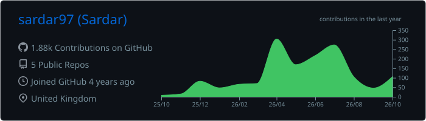
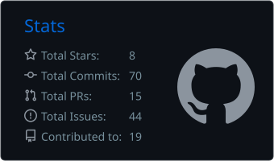
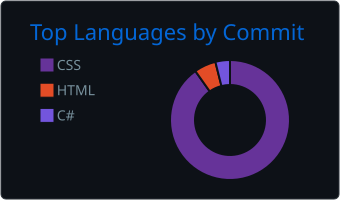

**Full-stack .NET developer (4+ years)** building real-world business software with **C#, Blazor, ASP.NET Core and SQL Server** —
point-of-sale systems used by UK shops, real-time dashboards, and open-source Blazor component libraries.

---

### 🚀 Featured Projects

| Project | What it is | Stack |
|---|---|---|
| [**MudKeyboard**](https://github.com/sardar97/mudkeyboard)     | On-screen virtual keyboard for Blazor & MudBlazor — 100% C#, **zero JavaScript**, AOT & trim friendly | Blazor · MudBlazor |
| [**MudShadcn**](https://github.com/sardar97/MudShadcn)    | shadcn/ui-style component library for Blazor, with docs site and components showcase | Blazor · .NET |
| [**Sardar POS**](https://sardarpos.co.uk) | Windows point-of-sale for UK retail shops — sales, stock, licensing, card payments | Avalonia · .NET · SQL |
| **Restaurant POS** | Ordering & kitchen POS for restaurants/takeaways with real-time updates | Blazor Server · SignalR · EF Core |
| **Sardar Hub** | Companion iPhone app — live shop dashboard for owners | React Native · Expo |

---

### 🛠️ Tech Stack

**Backend** &nbsp;

**Frontend & Apps** &nbsp;

**Data & DevOps** &nbsp;

---

### 📊 GitHub Stats

  

<picture>
  <source media="(prefers-color-scheme: dark)" srcset="https://raw.githubusercontent.com/sardar97/sardar97/output/github-contribution-grid-snake-dark.svg" />
  <source media="(prefers-color-scheme: light)" srcset="https://raw.githubusercontent.com/sardar97/sardar97/output/github-contribution-grid-snake.svg" />
  
</picture>

---

### 💡 How I Work

- **Ship to real users** — my apps run daily in shops and restaurants, so reliability beats hype.
- **Clean, layered code** — clear separation of UI, business logic and data (EF Core + SQL Server).
- **Real-time where it matters** — SignalR for live orders, dashboards and multi-device sync.
- **Open source** — I publish reusable Blazor components on NuGet.

📍 Burnley, UK

